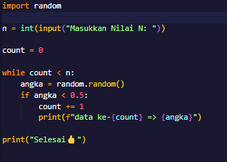
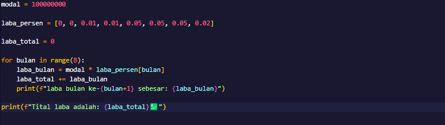
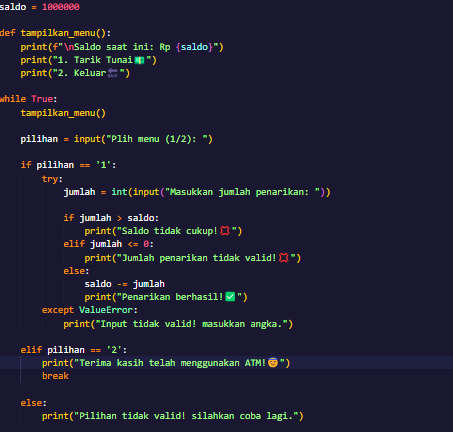
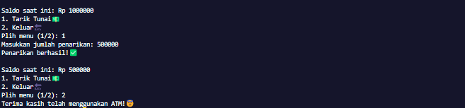

# labpy03
## Latihan 1 (Menampilkan Angka Random dibawah dari 0.5 sebanyak nilai N yang diinputkan)

### Penjelasan
Pada gambar diatas terdapat kode untuk menampilkan angka random yang lebih kecil dari 0.5, 

yang pertama yaitu mulai dari atas ada "import random", ini digunakan untuk Mengimpor modul random, yang berfungsi untuk menghasilkan bilangan acak. 

Kemudian ada "n = int(input(Masukkan Nilai n: ))", program ini akan meminta input dari user berupa bilangan bulat (int) yang menentukan berapa banyak angka acak yang akan dihasilkan.

Lalu ada Variable "count = 0", Variable ini digunakan sebagai penghitung untuk melacak berapa banyak angka acak yang telah dicetak.

Selanjutnya ada perulangan "while count < n:", While loop akan terus berjalan selama nilai count masih lebih kecil dari nilai n yang diberikan oleh user.

Kemudian ada "angka = random.random()", Untuk menghasilkan bilangan acak antara 0 dan 1.

Kemudian ada "if angka < 0.5:", Untuk mengecek apakah angka acak yang dihasilkan lebih kecil dari 0.5.

Lalu ada "count += 1", Jika kondisinya benar (angka acak lebih kecil dari 0.5), maka variable count ditambahkan 1.

Selanjutnya yaitu "print(f"data ke-{count} => {angka}")"

Dan yang terakhir "print("Selesai"), Setelah loop selesai (karena count sudah mencapai nilai n), program akan mencetak "Selesai" sebagai tanda bahwa program sudah selesai berjalan.
### Output

Sebagai contoh user memasukkan nilai n yaitu 5 (dapat diganti menjadi angka berapapun)

## Latihan 2(Investasi dalam 8 bulan)

### Penjelasan
Pada gambar diatas langkah pertama adalah memasukkan modal, sebagai contoh disini modal = 100000000(100Juta).

Lalu selanjutnya adalah membuat daftar persentasi laba perbulan "laba_persen = [0, 0, 0.01, 0.01, 0.05, 0.05, 0.05, 0.02]", Daftar ini berisi persentasi laba per bulan selama 8 bulan. Misalnya Misalnya, bulan ke-1 dan ke-2 tidak menghasilkan laba (0), bulan ke-3 dan ke-4 menghasilkan laba sebesar 1%, dan seterusnya.

Langkah selanjutnya adalah membuat variable "laba_total = 0", Variabel ini digunakan untuk menyimpan akumulasi laba selama 8 bulan.

Selanjutnya adalah membuat loop hingga 8 bulan "for bulan in range(8)", Loop ini berjalan dari 0 hingga 7 (total 8 kali, mewakili bulan ke-1 hingga ke-8).

Kemudian adalah mengkalikan modal dengan laba persen "laba_bulan = modal * laba_persen[bulan]", Pada setiap bulan, laba dihitung dengan mengalikan modal dengan persentase laba untuk bulan tersebut. Nilai laba_persen[bulan] mengambil persentase laba dari daftar berdasarkan bulan keberapa loop sedang dijalankan.

Lalu "laba_total += laba_bulan", Laba bulan ini kemudian ditambahkan ke laba_total untuk mendapatkan total laba hingga bulan tersebut.

Langkah Selanjutnya yaitu, "print(f"laba bulan ke-{bulan+1} sebesar: {laba_bulan}"), Mencetak laba untuk setiap bulan, dengan menampilkan nomor bulan dan jumlah laba yang dihasilkan.

Dan terakhir ada print(f"Total laba adalah: {laba_total}"), Setelah loop selesai, program akan mencetak total laba yang dihasilkan selama 8 bulan.
### Output

Program akan menampilkan laba dari bulan ke-1 hingga ke-8 dan juga totalnya.

## Latihan 3(Membuat mesin ATM)

### Penjelasan 
Pada gambar diatas adalah kode program untuk membuat sebuah ATM sederhana. langkah pertama adalah membuat sebuah variable baru yaitu variable "saldo = 1000000" sebagai contoh disini saya masukkan saldo nya adalah 1juta.

Selanjutnya yaitu "def tampilkan_menu():", Fungsi "tampilkan_menu()" digunakan untuk menampilkan menu utama pada layar, yang berisi informasi saldo saat ini dan dua opsi: tarik tunai atau keluar.

Lalu ada "while True:", Loop while ini berjalan tanpa henti hingga pengguna memilih untuk keluar (opsi 2). Di dalam loop ini, menu utama akan ditampilkan setiap kali kembali ke awal.

Kemudian "tampilkan_menu()", akan memanggil fungsi "tampilkan_menu()" untuk menampilkan saldo saat ini dan menu pilihan (1 untuk tarik tunai, 2 untuk keluar).

Selanjutnya ada "pilihan = input("Pilih menu (1/2): "), untuk meminta input dari user untuk memilih antara opsi 1 (tarik tunai) atau opsi 2 (keluar).

Lalu pada langkah ke-6 ada "if pilihan == '1':", jika user memilih opsi 1, program akan memproses penarikan tunai.

ke-7 ada "try", blok try digunakan untuk menangani input yang tidak valid, seperti jika user memasukkan nilai yang bukan angka.

"jumlah = int(input("Masukkan jumlah penarikan: "))", akan meminta user untuk memasukkan jumlah uang yang ingin ditarik, dan mengonversinya menjadi bilangan bulat (int).

Lalu "if jumlah > saldo", akan mengecek apakah jumlah yang diminta melebihi saldo yang ada. Jika ya, akan ditampilkan pesan bahwa saldo tidak cukup.

Langkah selanjutnya "elif jumlah <= 0:", akan memeriksa apakah jumlah yang dimasukkan kurang dari atau sama dengan nol. Jika ya, akan ditampilkan pesan bahwa jumlah penarikan tidak valid.

"else:", Jika jumlah valid (lebih dari nol dan tidak melebihi saldo), maka saldo akan dikurangi dengan jumlah tersebut, dan ditampilkan pesan bahwa penarikan berhasil.

"except ValueError:", Jika input user bukan angka (misalnya huruf atau karakter lain), maka program akan menganggap kesalahan ValueError dan menampilkan pesan bahwa input tidak valid.

"elif pilihan == '2':", Jika user memilih opsi 2, program akan menampilkan pesan terima kasih dan menghentikan loop dengan break, yang mengakhiri program.

Dan terakhir "else:", Jika user memasukkan pilihan selain '1' atau '2', program akan menampilkan pesan bahwa pilihan tidak valid, dan meminta pengguna untuk mencoba lagi.
### Output

Sebagai contoh disini awalnya saya memilih angka 1 untuk menarik tunai dan bisa dilihat saldo awalnya adalah 1juta dan saya melakukan penarikan sebesar 500ribu dan saldo berkurang menjadi 500ribu kemudian saya pilih angka 2 untuk keluar.